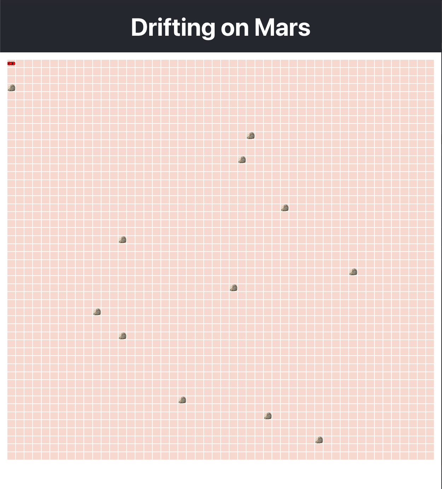

# Card ride for Mars

## Description

Easy ride for Mars...

## Table of Contents

If your README is long, add a table of contents to make it easy for users to find what they need.

- [Installation](#installation)
- [Usage](#usage)
- [Credits](#credits)
- [License](#license)

## Installation

1.  Clone this repo using `git clone https://github.com/Adri-Antanon/car-drive.git`
2.  Move to the appropriate directory: `cd car-drive/ & npm i` in order to install dependencies.
3.  Run `npm run dev` to see the example app at `http://localhost:3000`.

## Usage

## Credits

All credits for 73nko.

## Features

Explore mars as if you were there with the arrow keys and generate different environments by refreshing the page
